# End-to-End MLOps Pipeline — NYC Taxi Trip Duration

## Project Overview

This project demonstrates a **complete Machine Learning pipeline**, from loading raw data to production-ready components, following MLOps best practices.

The goal is to predict **NYC taxi trip duration** using historical data, with a focus on:

- Reproducibility
- Data quality
- Separation between training and serving
- Production-oriented design

---

## Tech Stack

- **Python 3.11**
- **pandas, numpy**
- **scikit-learn**
- **XGBoost**
- **MLflow** (experiment tracking & model registry)
- **Feast** (feature store)
- **FastAPI** (model serving)
- **Docker / docker-compose** (optional)

---

## Dataset

NYC Taxi Trip Records (public open dataset):  
[NYC Taxi Data](https://www.nyc.gov/site/tlc/about/tlc-trip-record-data.page)

- Subset of **Yellow Taxi 2015** to keep experiments lightweight
- Main files:

```
data/raw/
  yellow_tripdata_2015-01.csv
  yellow_tripdata_2015-01.parquet
data/processed/
  taxi_ml_2015_01.parquet
feature_repo/taxi_features/data/
  driver_stats.parquet
```

---

## ML Task

**Supervised regression**:

- Target: `trip_duration_seconds`  
- Main metrics: **RMSE**, **MAE**
- Optimization: **Hyperparameter Tuning** (conditional), **Early Stopping**

---

## Project Structure

```
mlops-end-to-end-taxi/
│
├── data/
│   ├── raw/                    # original, immutable data
│   └── processed/              # cleaned and ML-ready data
│
├── notebooks/
│   └── 01_eda.ipynb           # Exploratory Data Analysis
│
├── src/
│   ├── etl/
│   │   ├── extract.py
│   │   ├── transform.py
│   │   ├── load.py
│   │   ├── run_etl.py
│   │   ├── convert_csv_to_parquet.py
│   │   └── __init__.py
│   │
│   ├── config.py
│   ├── utils.py
│   └── __init__.py
│
├── feature_repo/taxi_features/  # Feast feature repo
│   ├── feature_definitions.py
│   ├── taxi_trip_source.py
│   ├── driver_stats.parquet
│   ├── test_workflow.py
│   └── feature_store.yaml
│
├── training/
│   ├── train.py               # entry point
│   ├── model_training.py      # training logic (XGBoost + Feast)
│   └── __init__.py
│
├── mlruns/                     # MLflow experiments (auto-generated)
├── notebooks/                  # EDA notebooks
├── requirements.txt
├── README.md
└── .gitignore
```

---

## Pipeline Steps

1. **Exploratory Data Analysis (EDA)**  
   - Preliminary analysis, missing values, target distribution, correlations

2. **ETL & Data Cleaning**
   - CSV/Parquet extraction
   - Transformations: outlier handling, data types, temporal features

3. **Feature Engineering**
   - Calculation of hour, day_of_week, is_weekend
   - Creation of geographical and derived features

4. **Feature Store Integration (Feast)**
   - Organizes and serves features consistently between training and serving

5. **Model Training & Optimization (XGBoost + MLflow)**
   - **Tuning**: Support for `RandomizedSearchCV` to optimize hyperparameters.
   - **Early Stopping**: Integration to prevent overfitting.
   - **Tracking**: Logging of parameters (base and tuned), metrics, and models in MLflow.
   - Example run:
     ```
     RMSE: 148.39
     MAE: 50.92
     ```


## Pipeline Architecture

```mermaid
flowchart TB
    subgraph Data["📦 Data Layer"]
        A[NYC Taxi Raw Data<br/>CSV / Parquet]
        B[ETL Pipeline<br/>Extract · Transform · Load]
        C[Processed Dataset<br/>Parquet]
        A --> B --> C
    end

    subgraph Features["📊 Feature Layer"]
        D[Feature Engineering]
        E[Feature Store<br/>Feast]
        C --> D --> E
    end

    subgraph Training["🤖 Training Layer"]
        F[XGBoost Training]
        G[Hyperparameter Tuning<br/>RandomizedSearchCV]
        H[Experiment Tracking<br/>MLflow]
        E --> F
        F --> G
        G --> H
    end

    subgraph Serving["🚀 Serving Layer"]
        I[Model Registry<br/>MLflow]
        H --> I
    end
    
```



---

## How to Run

### 1. Setup Environment

```bash
make install
```

### 2. Run ETL Pipeline

```bash
make run_etl
```

This command extracts raw data, transforms it using the logic in `src/etl`, and saves the processed parquet file to `data/processed/`.

### 3. Feature Store

```bash
cd feature_repo/taxi_features
feast apply
```

### 4. Model Training
```bash
make train
```

This runs the XGBoost training pipeline with default (optimized) settings.

### 5. Hyperparameter Tuning

```bash
make train-tune
```

Runs a `RandomizedSearchCV` phase on a subset of the data (for speed) to find the best parameters, then trains the final model.

### 5. Running Tests

```bash
make test
```

### 6. Code Quality

```bash
make lint
make format
```

### 7. MLflow UI

```bash
mlflow ui
```

### 8. Generating Reports

```bash
make reports
```

This generates visualization plots and an interactive map in the `reports/` folder.

### 9. Running with Docker

If you prefer using Docker, you can start the environment with:

```bash
docker-compose up --build
```

This will:
- Spin up an **MLflow** server on `http://localhost:5001`.
- Provide an `app` container where you can run commands:
  ```bash
  docker-compose exec app make run_etl
  docker-compose exec app make train
  ```

---

## Results

Final XGBoost run:

```
RMSE: 148.39
MAE: 50.92
```

Model logged in MLflow and reproducible

## Visual Reports

I've included some key charts and an interactive map in the `reports/` folder.

### Figures

*Figure 1 — Feature importance (XGBoost).*


*Figure 2 — Predicted vs Actual (sample).*


*Figure 3 — Residuals distribution (Actual - Predicted).*


*Figure 4 — Average duration by hour × day of week.*

### Interactive Map
The pickup sample map is saved as HTML:
- `reports/maps/pickup_sample_map.html` (open in browser)


---

## Notes / Next Steps

Fully end-to-end pipeline ready for portfolio

Future improvements:
- Advanced models (LightGBM, CatBoost, neural networks)
- FastAPI serving API
- Drift detection and metrics monitoring

---

## References

- [NYC Taxi & Limousine Commission Dataset](https://www.nyc.gov/site/tlc/about/tlc-trip-record-data.page)
- [MLflow Docs](https://mlflow.org/docs/latest/index.html)
- [Feast Docs](https://docs.feast.dev/)